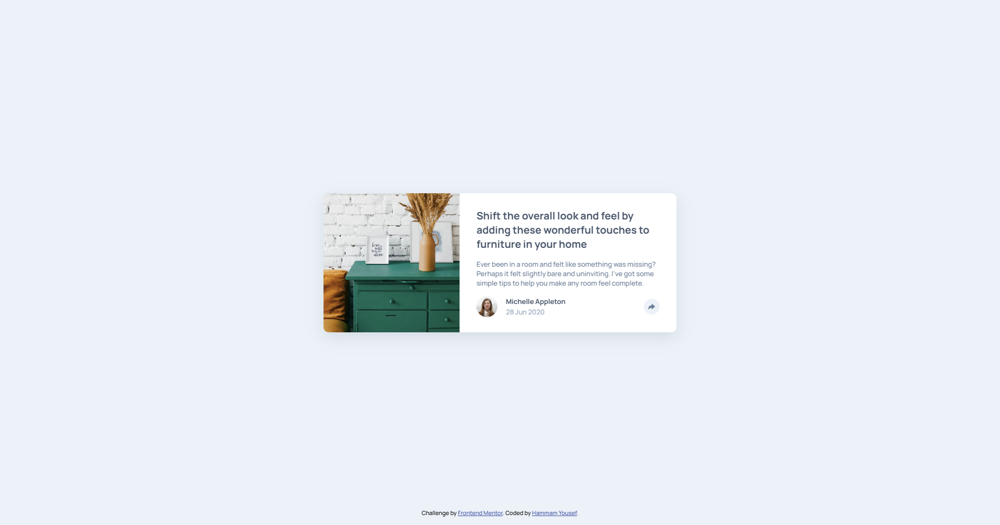

# Frontend Mentor - Article preview component solution

This is a solution to the [Article preview component challenge on Frontend Mentor](https://www.frontendmentor.io/challenges/article-preview-component-dYBN_pYFT). Frontend Mentor challenges help you improve your coding skills by building realistic projects. 

## Table of contents

- [Overview](#overview)
  - [The challenge](#the-challenge)
  - [Screenshot](#screenshot)
  - [Links](#links)
- [My process](#my-process)
  - [Built with](#built-with)
  - [What I learned](#what-i-learned)
  - [Continued development](#continued-development)
  - [Useful resources](#useful-resources)
- [Author](#author)
- [Acknowledgments](#acknowledgments)

## Overview

### The challenge

Users should be able to:

- View the optimal layout for the component depending on their device's screen size
- See the social media share links when they click the share icon, with an animated popup

### Screenshot



### Links

- Solution URL: [Add solution URL here](https://your-solution-url.com)
- Live Site URL: [Add live site URL here](https://your-live-site-url.com)

## My process

### Built with

- Semantic HTML5 markup
- CSS custom properties
- Flexbox
- Mobile-first workflow
- [Animate.css](https://animate.style/) - For popup animation

### What I learned

I learned how to use [Animate.css](https://animate.style/) to animate elements on user interaction.  
When the share button is clicked, the social links popup (`.card-links`) animates in and out using Animate.css classes (`animate__bounceInUp` and `animate__bounceOutDown`).  
This is handled in `main.js` by toggling classes and listening for the animation end event to hide the popup.

**Example:**
```js
shareBtn.addEventListener("click", () => {
  let isClosed = cardLinks.classList.contains("hidden");
  if (isClosed) {
    cardLinks.classList.remove("hidden");
    cardLinks.classList.remove("animate__bounceOutDown");
    cardLinks.classList.add("animate__animated", "animate__bounceInUp");
    shareBtn.classList.add("active");
  } else {
    cardLinks.classList.remove("animate__bounceInUp");
    cardLinks.classList.add("animate__bounceOutDown");
    shareBtn.classList.remove("active");
    cardLinks.addEventListener("animationend", function handler() {
      cardLinks.classList.add("hidden");
      cardLinks.classList.remove("animate__animated", "animate__bounceOutDown");
      cardLinks.removeEventListener("animationend", handler);
    });
  }
});
```

### Continued development

I want to explore more animation libraries and improve accessibility for interactive elements.

### Useful resources

- [Animate.css Documentation](https://animate.style/) - Used for popup animation.

## Author

- Frontend Mentor - [@HammamYousef](https://www.frontendmentor.io/profile/HammamYousef)

## Acknowledgments

Thanks to Animate.css for making CSS animations easy to use!
